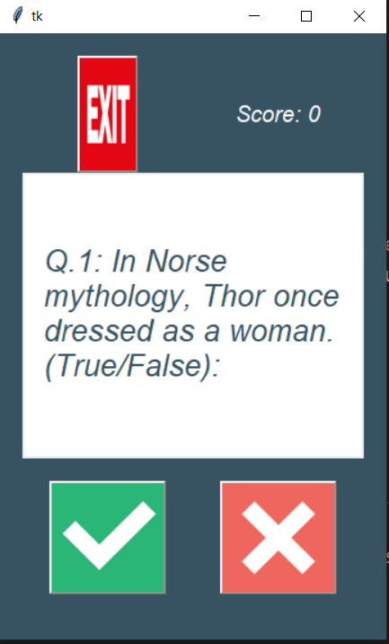

# TriviaQuestionsApp
A quiz app with user interface collects questions from the api of the Trivia site
The app has small but important features such as: disabling the buttons when the quiz ands or while the quiz is on the process to avoid multiple clicks in a single question.
The quiz question can easily be changed by usng an api.

